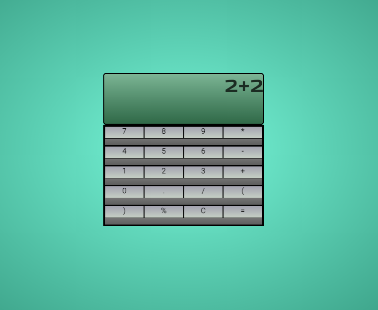

# Solo Project - JavaScript Calculator

Made by [**Bérengère Carpentier**](https://github.com/carpentierberengere):school_satchel:

Project began on the *16th of November* and finished on the *18th of November*.

# What was asked ? 

We were asked to create a functionning calculator using only Javascript to style it. 

# What did we do ?

We created a new [**repository**](https://github.com/carpentierberengere/calculator), with an HTML file as well as a JavaScript file inside. The index could only contain the usual squeletton and a **main** tag inside the **body** tag, linking the index with the JS script and from there creating a calculator. 

# What did we use ? 

* HTML5
* JavaScript
* These [***Instructions***](https://github.com/becodeorg/bxl-hopper-1-25/tree/master/The%20Hill/projects/1.calculator)

# Preview

# Link to GitHub Page

Want to test it ? Here you go :point_right:  click on the [**link**](https://carpentierberengere.github.io/calculator/) ! 
